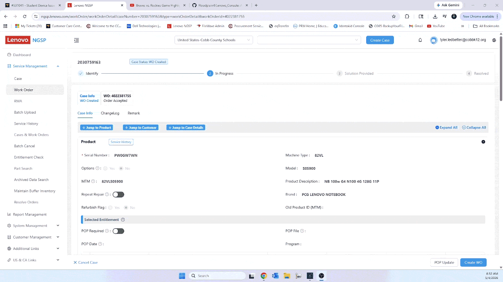

# 🖥️ Lenovo Case Tracker

A lightweight desktop utility for tracking Lenovo repair cases, parts, and workflow status in real-world IT environments.

[](https://github.com/Floodplain4/Lenovo_Console/releases)


---

## 🎬 Demo



---

## 🚀 Download

👉 **[Download Latest Release](https://github.com/Floodplain4/Lenovo_Console/releases/latest)**

> ⚠️ Windows may display a SmartScreen warning on first run.  
> Click **"More Info" → "Run Anyway"**.

---

## ✨ Features

### 📋 Case Management
- Track cases using Work Order and Serial Number  
- Status tracking with notes  
- Structured CSV-based logging  

---

### 🔧 Parts Tracking
- Quick-select buttons for common parts:
  - Top lid, Hinges, Bezel, LCD, Keyboard, Motherboard  
- Optional **“Other”** field for flexibility  

---

### ⚡ Workflow Automation
- Paste from Lenovo ticket:
  - Parses clipboard text  
  - Auto-fills Work Order and Serial Number  
  - Detects parts from descriptions  

---

### 📊 Dashboard
- Real-time stats:
  - Total, Ordered, Pending, Replaced, Returned, Complete  
- Visual indicators for quick status checks  

---

### 🔄 Entry Management
- Update status via dropdown  
- Edit entries with double-click  
- Bulk actions with confirmation  
- Delete single or multiple entries  

---

### 🔍 Search & Filtering
- Search across all fields  
- Filter by status or part type  
- Instant log updates  

---

### 📁 Data Handling
- Local CSV storage (`lcd_log.csv`)  
- Import and export support  
- Automatic backup before import  

---

### 🧠 Quality of Life
- Duplicate detection  
- Automatic timestamp updates  
- Right-click actions:
  - Copy serial  
  - Copy work order  
  - Copy full case summary  
- Built-in LCD script helper  

---

## 🛠 Installation

### Option 1: Download EXE (Recommended)
1. Download from the release page  
2. Run the `.exe` file  
3. If prompted:
   - Click **More Info**
   - Click **Run Anyway**

---

### Option 2: Run from Source

```bash
pip install PySide6 pyperclip
python src/lenovo_case_tracker.py
```
---

## 📦 How It Works

* Data is stored locally in a CSV file (`lcd_log.csv`)
* Changes are written instantly
* No database or internet connection required

---

## ⚠️ Notes

* First launch may take a few seconds (PyInstaller one-file build)
* This tool is designed for internal workflow use
* All included CSV files are for demonstration purposes only

---

## 🧑‍💻 About This Project

This started as a personal tool to improve efficiency in a real-world IT workflow environment.
The goal was to build something fast, practical, and easy to use — without unnecessary complexity.

---

## 📌 Future Improvements

* Installer polish and signing
* UI refinements
* Additional automation features
* Improved data visualization

---

## 📄 License

MIT License

---

## 💬 Feedback

If you find this useful or have suggestions, feel free to open an issue.
