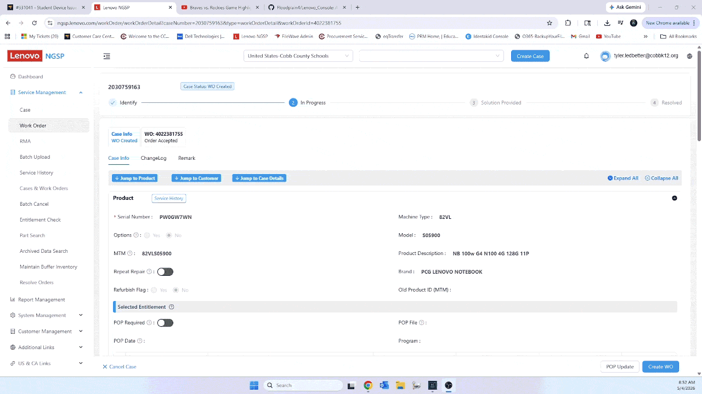

<<<<<<< HEAD
# 🖥️ Lenovo Case Tracker

A lightweight desktop utility for tracking Lenovo repair cases, triaging support emails, and managing follow-ups in real-world IT environments.

[](https://github.com/Floodplain4/Lenovo_Console/releases)
[](https://github.com/Floodplain4/Lenovo_Console/releases/tag/2.4.6)


---

## 🎬 Demo



---

## 🚀 Download

👉 **[Download Latest Release](https://github.com/Floodplain4/Lenovo_Console/releases/latest)**

> ⚠️ Windows may display a SmartScreen warning on first run.  
> Click **"More Info" → "Run Anyway"**.

---

## ✨ Features

### 📋 Case Tracking
- Track repair cases by Work Order and Serial Number
- Manage statuses (Ordered, Pending, Received, Replaced, Returned, Complete)
- Track parts used and notes for each case
- Automatic timestamp updates

### 📧 Email Triage
- Scan unread Outlook emails (read-only)
- Analyze pasted text from emails, tickets, or messages
- Detect likely support requests with confidence scoring
- Identify potential hardware issues (LCD, hinges, etc.)
- Generate suggested responses
- Create case entries directly from emails

### ⚠️ Follow-Up System
- Automatically flags cases not updated in 5 business days
- Manually mark cases for follow-up
- Snooze follow-ups for 24 hours
- Review all flagged cases in one place

### 📊 Dashboard & Quick Stats
- Real-time case counts by status
- Follow-up alerts
- Repeat serial detection
- Email scan tracking

### 🔧 Workflow Tools
- Paste-from-ticket parsing (auto-detect serial, work order, parts)
- Right-click actions (copy serial, work order, summary)
- CSV import/export with backup

### 🔄 Entry Management
- Update status via dropdown  
- Edit entries with double-click  
- Bulk actions with confirmation  
- Delete single or multiple entries  

---

### 🔍 Search & Filtering
- Search across all fields  
- Filter by status or part type  
- Instant log updates  

---

### 📁 Data Handling
- Local CSV storage (`lcd_log.csv`)  
- Import and export support  
- Automatic backup before import  

---

### 🧠 Quality of Life
- Duplicate detection  
- Automatic timestamp updates  
- Right-click actions:
  - Copy serial  
  - Copy work order  
  - Copy full case summary  
- Built-in LCD script helper  

---

## 🛠 Installation

### Option 1: Download EXE (Recommended)
1. Download from the release page  
2. Run the `.exe` file  
3. If prompted:
   - Click **More Info**
   - Click **Run Anyway**

---

### Option 2: Run from Source

```bash
pip install PySide6 pyperclip
python src/lenovo_case_tracker.py
```
---

## 📦 How It Works

* Data is stored locally in a CSV file (`lcd_log.csv`)
* Changes are written instantly
* No database or internet connection required
- Email features are **read-only** and do not send automatic replies
- Designed for internal workflow use
---

## ⚠️ Notes

* First launch may take a few seconds (PyInstaller one-file build)
* This tool is designed for internal workflow use
* All included CSV files are for demonstration purposes only

---

## 🧑‍💻 About This Project

This started as a personal tool to improve efficiency in a real-world IT workflow environment.
The goal was to build something fast, practical, and easy to use — without unnecessary complexity.

---

## 📌 Future Improvements

* Installer polish and signing
* UI refinements
* Additional automation features
* Improved data visualization

---

## 📄 License

MIT License

---

## 💬 Feedback

If you find this useful or have suggestions, feel free to open an issue.
=======
# Lenovo Case Tracker

A desktop utility I built for tracking Lenovo repair cases, statuses, parts, notes, and repeat hardware issues.

This originally started as a basic CSV tracker for day-to-day field tech work and slowly turned into a more complete repair tracking application. The current version uses SQLite instead of relying entirely on CSV storage and includes a more responsive UI layout, repeat serial tracking, filtering, import/export support, and repair workflow management.

## Current Development Branch

`sqlite-ui`

This branch contains the ongoing SQLite/database migration work and UI cleanup before merging back into main.

## Features

- Track Lenovo repair cases by:
  - Work Order
  - Serial Number
  - Status
  - Parts
  - Notes
  - Timestamp

- Add, edit, update, and delete repair entries
- Search across all visible case data
- Filter by:
  - Status
  - Parts

- CSV import/export support
- SQLite database backend
- Responsive UI improvements for smaller/windowed displays
- Repeat serial number detection
- Dashboard statistics
- Follow-up tracking
- Email triage tools for ticket review workflow

## Repeat Serial Detection

One of the newer additions is repeat serial detection.

The app tracks devices that appear multiple times in the repair log and allows quick review of:
- Repeat repair counts
- Previous work orders
- Repair statuses
- Latest timestamps

This was added because recurring hardware issues became difficult to track manually once the dataset grew larger.

## Why SQLite

The original CSV version worked fine for smaller datasets, but it started becoming harder to manage once the repair log reached several hundred entries.

Migrating to SQLite made it easier to:
- Search and filter efficiently
- Handle larger datasets
- Reduce duplicate handling issues
- Move toward a more maintainable application structure
- Practice real database-backed application development

## Tech Used

- Python
- PySide6
- SQLite
- CSV import/export
- Git/GitHub

## Notes

This project is still primarily a practical internal workflow tool. Most changes are driven by real-world repair tracking and field tech workflow issues rather than building features just for the sake of adding them.

At the same time, I have been using the project to improve:
- Database design
- Version control workflow
- UI structure
- Application organization
- General software development practices

## Roadmap

- Clean up remaining CSV-era logic
- Improve database structure and normalization
- Add status history tracking
- Improve error handling and import validation
- Add screenshots/GIF demos to README
- Improve dashboard analytics
- Package updated SQLite version into a stable EXE release
- Explore possible future web-based version
>>>>>>> sqlite-ui
